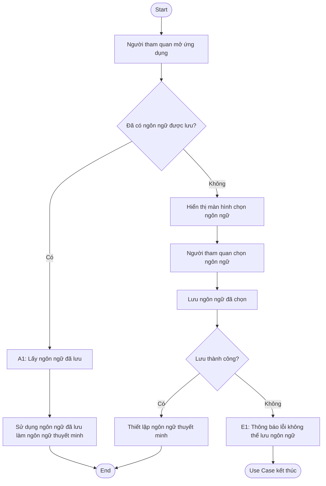
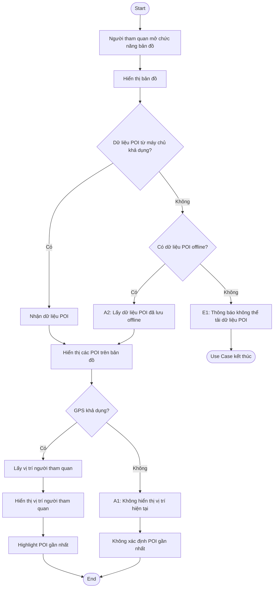
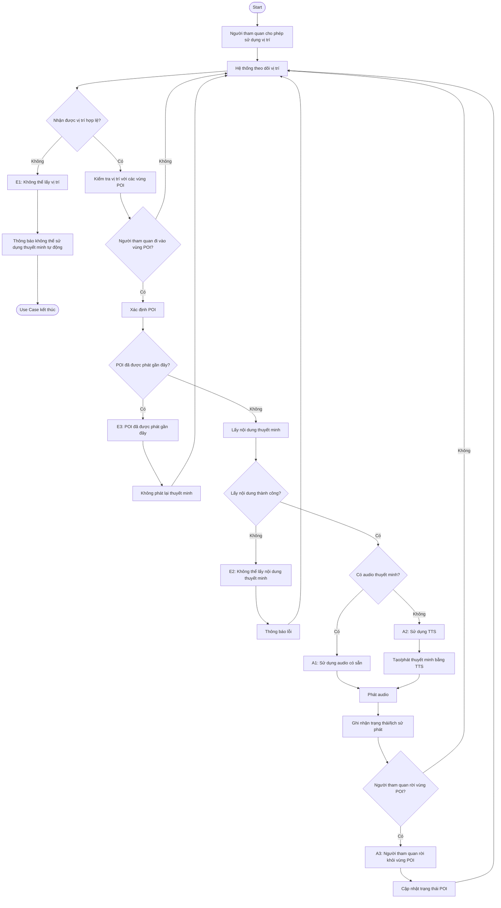
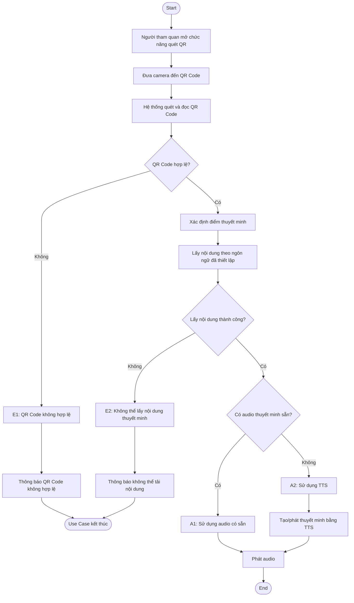
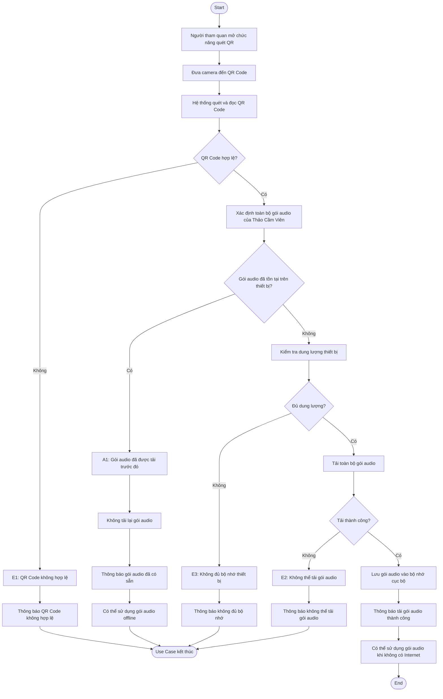
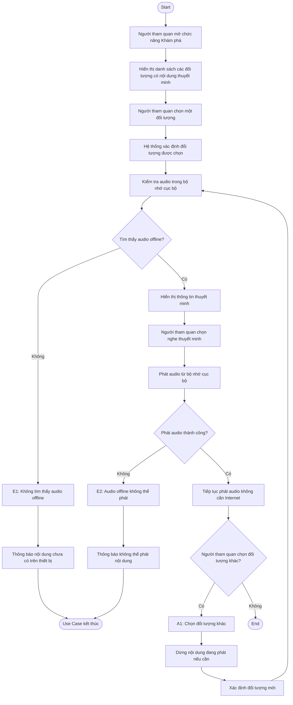
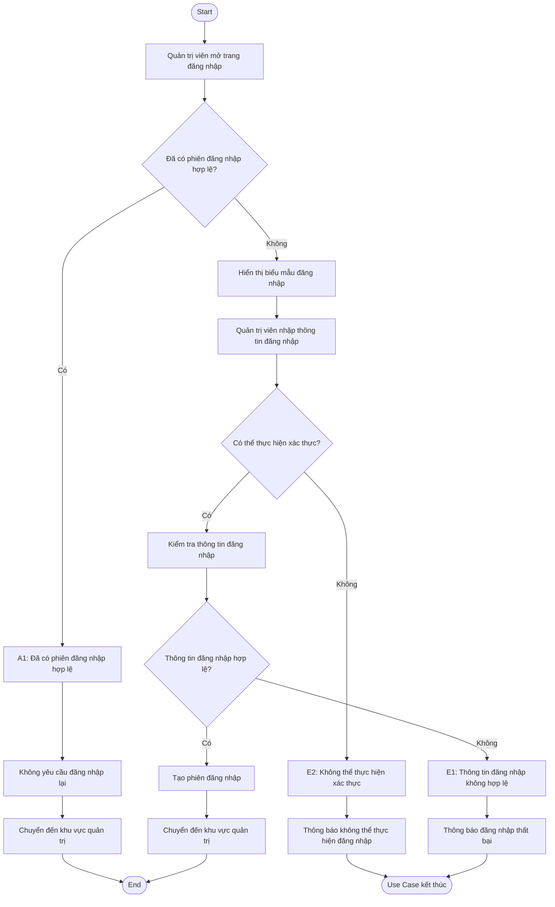
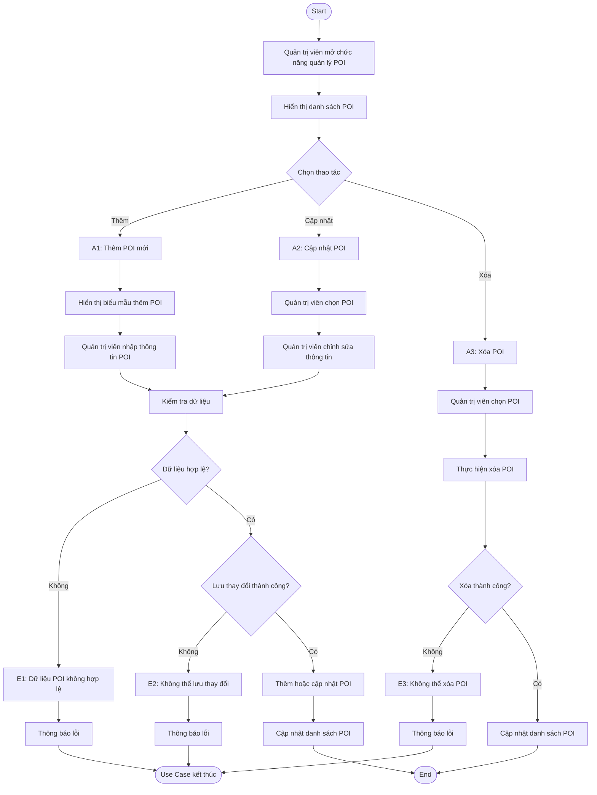
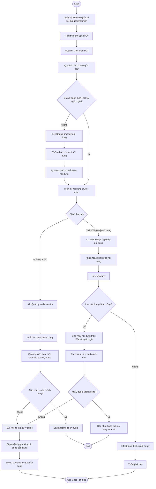
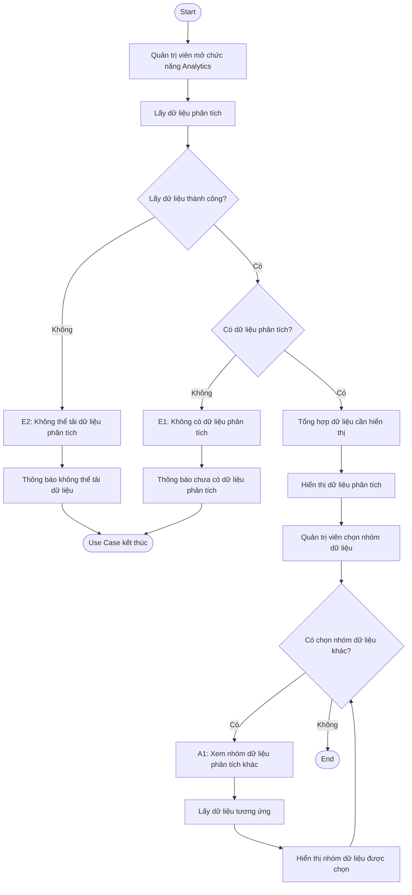

# UC-01 — Thiết lập ngôn ngữ thuyết minh

## Use Case
**UC-01 — Thiết lập ngôn ngữ thuyết minh**

## User
**Người tham quan**

## Summary
Khi người tham quan mở ứng dụng lần đầu, hệ thống hiển thị màn hình lựa chọn ngôn ngữ. Người tham quan chọn một ngôn ngữ được hệ thống hỗ trợ, sau đó hệ thống lưu lựa chọn và sử dụng ngôn ngữ này làm ngôn ngữ cho nội dung thuyết minh.

## Basic Course of Events

| Step | User | System |
|------|------|--------|
| 1 | Người tham quan mở ứng dụng. | Hệ thống khởi động ứng dụng và kiểm tra ngôn ngữ đã được lưu trên thiết bị. |
| 2 | — | Hệ thống kiểm tra ngôn ngữ đã được lưu. **Nếu đã có ngôn ngữ → (A1)** |
| 3 | — | Hệ thống hiển thị màn hình lựa chọn ngôn ngữ. |
| 4 | Người tham quan chọn một ngôn ngữ. | Hệ thống tiếp nhận ngôn ngữ được chọn. |
| 5 | — | Hệ thống lưu ngôn ngữ đã chọn. **Nếu không thể lưu → (E1)** |
| 6 | — | Hệ thống thiết lập ngôn ngữ đã chọn làm ngôn ngữ thuyết minh. |
| 7 | — | Use Case kết thúc. |

## Alternative Path

### A1 — Người dùng đã có ngôn ngữ được lưu trước đó
1. Người tham quan mở ứng dụng.
2. Hệ thống kiểm tra ngôn ngữ đã được lưu trên thiết bị.
3. Hệ thống tìm thấy ngôn ngữ đã được thiết lập.
4. Hệ thống sử dụng ngôn ngữ đã lưu làm ngôn ngữ thuyết minh.
5. Người tham quan tiếp tục sử dụng ứng dụng mà không cần chọn lại.

## Exception Paths

### E1 — Không thể lưu ngôn ngữ đã chọn
1. Người tham quan chọn ngôn ngữ.
2. Hệ thống không thể lưu lựa chọn ngôn ngữ.
3. Hệ thống thông báo lỗi.
4. Use Case kết thúc mà ngôn ngữ chưa được thiết lập thành công.

## Diagram

# UC-02 — Xem bản đồ và các điểm thuyết minh

## Use Case
**UC-02 — Xem bản đồ và các điểm thuyết minh**

## User
**Người tham quan**

## Summary
Người tham quan sử dụng chức năng bản đồ để xem vị trí của mình và các điểm thuyết minh (POI) trong hệ thống. Hệ thống hiển thị các POI trên bản đồ và có thể làm nổi bật POI gần vị trí hiện tại của người tham quan.

## Basic Course of Events

| Step | User | System |
|------|------|--------|
| 1 | Người tham quan mở chức năng bản đồ. | Hệ thống hiển thị bản đồ và kiểm tra khả năng lấy dữ liệu POI từ máy chủ. |
| 2 | — | Hệ thống kiểm tra dữ liệu POI từ máy chủ. **Nếu dữ liệu POI từ máy chủ khả dụng → tiếp tục bước 3.** **Nếu không khả dụng → (A2)** |
| 3 | — | Hệ thống nhận dữ liệu POI từ máy chủ. |
| 4 | — | Hệ thống hiển thị các POI trên bản đồ. |
| 5 | — | Hệ thống kiểm tra khả năng lấy vị trí GPS của người tham quan. **Nếu GPS không khả dụng → (A1)** |
| 6 | — | Hệ thống lấy vị trí hiện tại của người tham quan. |
| 7 | — | Hệ thống hiển thị vị trí hiện tại của người tham quan trên bản đồ. |
| 8 | — | Hệ thống xác định và highlight POI gần nhất. |
| 9 | — | Use Case kết thúc. |

## Alternative Path

### A1 — Không có vị trí GPS
1. Người tham quan mở chức năng bản đồ.
2. Hệ thống tải và hiển thị bản đồ.
3. Hệ thống hiển thị các POI.
4. Hệ thống không hiển thị vị trí hiện tại của người tham quan.
5. Hệ thống không thực hiện xác định POI gần nhất dựa trên vị trí hiện tại.

### A2 — Sử dụng dữ liệu POI đã lưu offline
1. Hệ thống không lấy được dữ liệu POI mới từ máy chủ.
2. Hệ thống kiểm tra dữ liệu POI đã được lưu trên thiết bị.
3. Hệ thống sử dụng dữ liệu POI cục bộ.
4. Hệ thống hiển thị các POI trên bản đồ.

## Exception Paths

### E1 — Không có dữ liệu POI khả dụng
1. Hệ thống không lấy được dữ liệu POI từ máy chủ.
2. Hệ thống không tìm thấy dữ liệu POI đã lưu trên thiết bị.
3. Hệ thống thông báo không thể tải dữ liệu POI.
4. Chức năng hiển thị POI kết thúc.

## Diagram

# UC-03 — Nhận thuyết minh tự động theo vị trí

## Use Case
**UC-03 — Nhận thuyết minh tự động theo vị trí**

## User
**Người tham quan**

## Summary
Khi người tham quan cho phép hệ thống sử dụng vị trí, hệ thống theo dõi vị trí hiện tại và kiểm tra vị trí đó với các vùng kích hoạt của các điểm thuyết minh (POI). Khi người tham quan đi vào vùng của một POI, hệ thống xác định POI tương ứng và tự động xử lý nội dung thuyết minh để phát cho người tham quan.

## Basic Course of Events

| Step | User | System |
|------|------|--------|
| 1 | Người tham quan cho phép hệ thống sử dụng vị trí. | Hệ thống bắt đầu theo dõi vị trí hiện tại của người tham quan. |
| 2 | — | Hệ thống kiểm tra dữ liệu vị trí có hợp lệ hay không. **Nếu không nhận được vị trí hợp lệ → (E1)** |
| 3 | — | Hệ thống kiểm tra vị trí hiện tại với các vùng kích hoạt của các POI. |
| 4 | — | Hệ thống kiểm tra người tham quan có đi vào vùng của một POI hay không. **Nếu chưa đi vào vùng POI → tiếp tục theo dõi vị trí.** |
| 5 | — | Hệ thống xác định POI tương ứng khi người tham quan đi vào vùng kích hoạt. |
| 6 | — | Hệ thống kiểm tra trạng thái/lịch sử phát thuyết minh của POI. **Nếu POI đã được phát gần đây → (E3)** |
| 7 | — | Hệ thống lấy nội dung thuyết minh của POI. **Nếu không thể lấy nội dung → (E2)** |
| 8 | — | Hệ thống kiểm tra POI có audio thuyết minh sẵn hay không. |
| 9 | — | **Nếu có audio → (A1):** Hệ thống sử dụng audio có sẵn và phát cho người tham quan. **Nếu không có audio → (A2):** Hệ thống sử dụng nội dung văn bản để tạo/phát thuyết minh bằng TTS. |
| 10 | — | Hệ thống ghi nhận trạng thái/lịch sử phát thuyết minh. |
| 11 | — | Hệ thống tiếp tục theo dõi vị trí và kiểm tra người tham quan có rời khỏi vùng POI hay không. **Nếu người tham quan rời vùng POI → (A3)** |
| 12 | — | Hệ thống cập nhật trạng thái POI sau khi người tham quan rời khỏi vùng. |
| 13 | — | Hệ thống tiếp tục theo dõi vị trí để phát hiện các POI tiếp theo. |

## Alternative Path

### A1 — POI có sẵn audio thuyết minh
1. Hệ thống phát hiện người tham quan đi vào vùng của một POI.
2. Hệ thống xác định POI tương ứng.
3. Hệ thống kiểm tra nội dung thuyết minh.
4. Hệ thống tìm thấy audio thuyết minh của POI.
5. Hệ thống phát audio cho người tham quan.

### A2 — POI không có audio, sử dụng TTS
1. Hệ thống phát hiện người tham quan đi vào vùng của một POI.
2. Hệ thống xác định POI tương ứng.
3. Hệ thống kiểm tra nội dung thuyết minh.
4. Hệ thống không tìm thấy audio thuyết minh có sẵn.
5. Hệ thống sử dụng nội dung văn bản để tạo/phát thuyết minh bằng TTS.
6. Hệ thống phát thuyết minh cho người tham quan.

### A3 — Người tham quan rời khỏi vùng của POI
1. Hệ thống phát hiện người tham quan đã rời khỏi vùng của POI.
2. Hệ thống xác định POI không còn nằm trong vùng hoạt động.
3. Hệ thống cập nhật trạng thái POI.
4. Hệ thống không tiếp tục kích hoạt thuyết minh của POI đó.

## Exception Paths

### E1 — Không thể lấy được vị trí người tham quan
1. Hệ thống yêu cầu vị trí hiện tại của người tham quan.
2. Hệ thống không nhận được dữ liệu vị trí hợp lệ.
3. Hệ thống không thể kiểm tra vùng kích hoạt của POI.
4. Hệ thống không tự động phát thuyết minh.
5. Hệ thống thông báo rằng không thể sử dụng chức năng thuyết minh tự động theo vị trí.

### E2 — Không thể lấy nội dung thuyết minh
1. Hệ thống phát hiện người tham quan đi vào vùng của POI.
2. Hệ thống xác định POI cần thuyết minh.
3. Hệ thống không lấy được nội dung thuyết minh cần thiết.
4. Hệ thống không thể phát thuyết minh.
5. Hệ thống thông báo lỗi.

### E3 — POI đã được phát gần đây
1. Hệ thống phát hiện người tham quan đi vào vùng của POI.
2. Hệ thống xác định POI tương ứng.
3. Hệ thống kiểm tra trạng thái/lịch sử phát thuyết minh.
4. Hệ thống xác định POI đã được phát gần đây.
5. Hệ thống không phát lại thuyết minh.
6. Hệ thống tiếp tục theo dõi vị trí của người tham quan.

## Diagram

# UC-04 — Kích hoạt thuyết minh bằng QR Code

## Use Case
**UC-04 — Kích hoạt thuyết minh bằng QR Code**

## User
**Người tham quan**

## Summary
Người tham quan quét QR Code được gắn tại một điểm thuyết minh trong Thảo Cầm Viên. Hệ thống đọc thông tin từ QR Code, xác định điểm thuyết minh tương ứng và cung cấp nội dung thuyết minh theo ngôn ngữ đã được thiết lập. Chức năng này không yêu cầu sử dụng GPS.

## Basic Course of Events

| Step | User | System |
|------|------|--------|
| 1 | Người tham quan mở chức năng quét QR. | Hệ thống mở chức năng quét QR Code. |
| 2 | Người tham quan đưa camera đến QR Code. | Hệ thống quét và đọc QR Code. |
| 3 | — | Hệ thống xác định điểm thuyết minh tương ứng với QR Code. |
| 4 | — | Hệ thống lấy nội dung thuyết minh theo ngôn ngữ đã được thiết lập. |
| 5 | — | Hệ thống kiểm tra nội dung thuyết minh. |
| 6 | — | Hệ thống phát nội dung thuyết minh cho người tham quan. |
| 7 | — | Use Case kết thúc. |

## Alternative Path

### A1 — Điểm thuyết minh có audio sẵn
1. Hệ thống xác định điểm thuyết minh tương ứng với QR Code.
2. Hệ thống kiểm tra nội dung thuyết minh.
3. Hệ thống tìm thấy audio có sẵn.
4. Hệ thống phát audio cho người tham quan.

### A2 — Điểm thuyết minh chưa có audio sẵn
1. Hệ thống xác định điểm thuyết minh tương ứng với QR Code.
2. Hệ thống kiểm tra nội dung thuyết minh.
3. Hệ thống không tìm thấy audio có sẵn.
4. Hệ thống sử dụng nội dung văn bản để tạo/phát thuyết minh bằng TTS.
5. Hệ thống phát thuyết minh cho người tham quan.

## Exception Paths

### E1 — QR Code không hợp lệ
1. Người tham quan thực hiện quét QR Code.
2. Hệ thống không thể xác định thông tin hợp lệ từ QR Code.
3. Hệ thống thông báo QR Code không hợp lệ.
4. Hệ thống yêu cầu người tham quan thực hiện lại thao tác quét hoặc kết thúc Use Case.

### E2 — Không thể lấy nội dung thuyết minh
1. Hệ thống xác định được điểm thuyết minh từ QR Code.
2. Hệ thống không thể lấy nội dung thuyết minh tương ứng.
3. Hệ thống thông báo không thể tải nội dung thuyết minh.
4. Use Case kết thúc.

## Diagram

# UC-05 — Tải gói audio thuyết minh offline

## Use Case
**UC-05 — Tải gói audio thuyết minh offline**

## User
**Người tham quan**

## Summary
Người tham quan quét QR Code được cung cấp bởi hệ thống để tải toàn bộ gói audio thuyết minh của Thảo Cầm Viên về thiết bị. Gói audio được tải về và lưu trữ cục bộ trên thiết bị, cho phép người tham quan nghe nội dung thuyết minh mà không cần kết nối Internet.

## Basic Course of Events

| Step | User | System |
|------|------|--------|
| 1 | Người tham quan mở chức năng quét QR. | Hệ thống mở chức năng quét QR Code. |
| 2 | Người tham quan đưa camera đến QR Code tải gói audio. | Hệ thống quét và đọc QR Code. |
| 3 | — | Hệ thống xác định gói audio thuyết minh của Thảo Cầm Viên. |
| 4 | — | Hệ thống kiểm tra trạng thái gói audio trên thiết bị. |
| 5 | — | Hệ thống tải toàn bộ gói audio thuyết minh về thiết bị. |
| 6 | — | Hệ thống lưu gói audio vào bộ nhớ cục bộ. |
| 7 | — | Hệ thống thông báo tải gói audio thành công. |
| 8 | — | Người tham quan có thể sử dụng gói audio để nghe thuyết minh khi không có Internet. |
| 9 | — | Use Case kết thúc. |

## Alternative Path

### A1 — Gói audio đã được tải trước đó
1. Người tham quan quét QR Code.
2. Hệ thống xác định gói audio thuyết minh của Thảo Cầm Viên.
3. Hệ thống kiểm tra dữ liệu đã lưu trên thiết bị.
4. Hệ thống phát hiện gói audio đã tồn tại trên thiết bị.
5. Hệ thống không tải lại gói audio.
6. Hệ thống thông báo gói audio đã có sẵn.
7. Người tham quan có thể sử dụng gói audio để nghe offline.
8. Use Case kết thúc.

## Exception Paths

### E1 — QR Code không hợp lệ
1. Người tham quan thực hiện quét QR Code.
2. Hệ thống không thể xác định gói audio hợp lệ từ QR Code.
3. Hệ thống thông báo QR Code không hợp lệ.
4. Use Case kết thúc.

### E2 — Không thể tải gói audio
1. Hệ thống xác định được gói audio cần tải.
2. Hệ thống bắt đầu tải toàn bộ gói audio.
3. Quá trình tải không thể hoàn thành.
4. Hệ thống thông báo không thể tải gói audio.
5. Hệ thống không đánh dấu gói audio là đã tải hoàn chỉnh.
6. Use Case kết thúc.

### E3 — Không đủ bộ nhớ thiết bị
1. Hệ thống xác định được gói audio cần tải.
2. Hệ thống kiểm tra dung lượng lưu trữ của thiết bị.
3. Hệ thống phát hiện thiết bị không đủ dung lượng.
4. Hệ thống không thực hiện tải gói audio.
5. Hệ thống thông báo không đủ bộ nhớ.
6. Use Case kết thúc.

## Diagram

# UC-06 — Khám phá và nghe thuyết minh offline

## Use Case
**UC-06 — Khám phá và nghe thuyết minh offline**

## User
**Người tham quan**

## Summary
Người tham quan sử dụng chức năng Khám phá để xem các đối tượng thuyết minh trong Thảo Cầm Viên và lựa chọn một đối tượng để nghe nội dung thuyết minh. Hệ thống sử dụng gói audio đã được lưu trên thiết bị từ UC-05, do đó người tham quan có thể nghe thuyết minh mà không cần kết nối Internet.

## Basic Course of Events

| Step | User | System |
|------|------|--------|
| 1 | Người tham quan mở chức năng Khám phá. | Hệ thống hiển thị danh sách các đối tượng có nội dung thuyết minh. |
| 2 | Người tham quan chọn một đối tượng. | Hệ thống xác định đối tượng được chọn. |
| 3 | — | Hệ thống kiểm tra audio thuyết minh tương ứng trong bộ nhớ cục bộ. |
| 4 | — | Hệ thống tìm thấy audio tương ứng. |
| 5 | — | Hệ thống hiển thị thông tin thuyết minh của đối tượng. |
| 6 | Người tham quan chọn nghe thuyết minh. | Hệ thống phát audio từ bộ nhớ cục bộ. |
| 7 | — | Hệ thống tiếp tục phát audio mà không cần kết nối Internet. |
| 8 | — | Use Case kết thúc. |

## Alternative Path

### A1 — Người tham quan chọn đối tượng khác trong danh sách
1. Người tham quan đang xem hoặc nghe một đối tượng.
2. Người tham quan chọn một đối tượng khác.
3. Hệ thống dừng nội dung đang được phát nếu cần.
4. Hệ thống xác định đối tượng mới.
5. Hệ thống kiểm tra audio tương ứng trong bộ nhớ cục bộ.
6. Hệ thống phát audio của đối tượng mới.

## Exception Paths

### E1 — Không tìm thấy audio offline
1. Người tham quan chọn một đối tượng.
2. Hệ thống kiểm tra audio tương ứng trong bộ nhớ cục bộ.
3. Hệ thống không tìm thấy audio.
4. Hệ thống thông báo nội dung thuyết minh của đối tượng chưa có trên thiết bị.
5. Hệ thống không phát thuyết minh offline.
6. Use Case kết thúc.

### E2 — Audio offline không thể phát
1. Người tham quan chọn một đối tượng.
2. Hệ thống tìm thấy audio tương ứng trong bộ nhớ cục bộ.
3. Hệ thống cố gắng phát audio.
4. Hệ thống không thể phát audio.
5. Hệ thống thông báo không thể phát nội dung thuyết minh.
6. Use Case kết thúc.

## Diagram

# UC-07 — Đăng nhập quản trị

## Use Case
**UC-07 — Đăng nhập quản trị**

## User
**Quản trị viên**

## Summary
Quản trị viên đăng nhập vào hệ thống quản trị để sử dụng các chức năng quản lý nội dung của hệ thống thuyết minh tự động đa ngôn ngữ. Hệ thống kiểm tra thông tin đăng nhập và chỉ cho phép truy cập khu vực quản trị khi thông tin hợp lệ.

## Basic Course of Events

| Step | User | System |
|------|------|--------|
| 1 | Quản trị viên mở trang đăng nhập quản trị. | Hệ thống hiển thị biểu mẫu đăng nhập. |
| 2 | Quản trị viên nhập thông tin đăng nhập. | Hệ thống tiếp nhận thông tin đăng nhập. |
| 3 | Quản trị viên gửi thông tin đăng nhập. | Hệ thống kiểm tra thông tin đăng nhập. |
| 4 | — | Hệ thống xác thực tài khoản quản trị. |
| 5 | — | Hệ thống tạo phiên đăng nhập cho quản trị viên. |
| 6 | — | Hệ thống chuyển quản trị viên đến khu vực quản trị. |
| 7 | — | Use Case kết thúc. |

## Alternative Path

### A1 — Quản trị viên đã có phiên đăng nhập hợp lệ
1. Quản trị viên truy cập khu vực quản trị.
2. Hệ thống kiểm tra phiên đăng nhập hiện tại.
3. Hệ thống xác định phiên đăng nhập vẫn hợp lệ.
4. Hệ thống không yêu cầu đăng nhập lại.
5. Hệ thống chuyển quản trị viên đến khu vực quản trị.
6. Use Case kết thúc.

## Exception Paths

### E1 — Thông tin đăng nhập không hợp lệ
1. Quản trị viên nhập thông tin đăng nhập.
2. Hệ thống kiểm tra thông tin đăng nhập.
3. Hệ thống xác định thông tin đăng nhập không hợp lệ.
4. Hệ thống thông báo đăng nhập thất bại.
5. Hệ thống yêu cầu quản trị viên nhập lại thông tin đăng nhập.
6. Use Case kết thúc.

### E2 — Không thể thực hiện xác thực
1. Quản trị viên gửi thông tin đăng nhập.
2. Hệ thống không thể hoàn tất quá trình xác thực.
3. Hệ thống thông báo không thể thực hiện đăng nhập.
4. Quản trị viên chưa được truy cập khu vực quản trị.
5. Use Case kết thúc.

## Diagram

# UC-08 — Quản lý POI

## Use Case
**UC-08 — Quản lý POI**

## User
**Quản trị viên**

## Summary
Quản trị viên sử dụng chức năng quản lý POI để xem và cập nhật dữ liệu các điểm thuyết minh trong hệ thống. Hệ thống hỗ trợ các thao tác thêm, cập nhật và xóa POI.

## Basic Course of Events

| Step | User | System |
|------|------|--------|
| 1 | Quản trị viên mở chức năng quản lý POI. | Hệ thống hiển thị danh sách các POI. |
| 2 | Quản trị viên chọn một thao tác quản lý POI. | Hệ thống hiển thị giao diện tương ứng với thao tác được chọn. |
| 3 | Quản trị viên nhập hoặc cập nhật thông tin POI. | Hệ thống tiếp nhận dữ liệu POI. |
| 4 | Quản trị viên gửi yêu cầu lưu thay đổi. | Hệ thống kiểm tra dữ liệu POI. |
| 5 | — | Hệ thống lưu thay đổi vào hệ thống. |
| 6 | — | Hệ thống cập nhật danh sách POI. |
| 7 | — | Use Case kết thúc. |

## Alternative Path

### A1 — Thêm POI mới
1. Quản trị viên chọn chức năng thêm POI.
2. Hệ thống hiển thị biểu mẫu thêm POI.
3. Quản trị viên nhập thông tin POI mới.
4. Quản trị viên gửi yêu cầu lưu.
5. Hệ thống kiểm tra dữ liệu.
6. Hệ thống tạo POI mới.
7. Hệ thống cập nhật danh sách POI.
8. Use Case kết thúc.

### A2 — Cập nhật POI
1. Quản trị viên chọn một POI trong danh sách.
2. Quản trị viên chỉnh sửa thông tin POI.
3. Quản trị viên gửi yêu cầu lưu.
4. Hệ thống kiểm tra dữ liệu.
5. Hệ thống cập nhật POI.
6. Hệ thống cập nhật danh sách POI.
7. Use Case kết thúc.

### A3 — Xóa POI
1. Quản trị viên chọn một POI trong danh sách.
2. Quản trị viên thực hiện thao tác xóa.
3. Hệ thống xóa POI.
4. Hệ thống cập nhật danh sách POI.
5. Use Case kết thúc.

## Exception Paths

### E1 — Dữ liệu POI không hợp lệ
1. Quản trị viên nhập hoặc cập nhật thông tin POI.
2. Hệ thống kiểm tra dữ liệu.
3. Hệ thống phát hiện dữ liệu không hợp lệ.
4. Hệ thống thông báo lỗi.
5. Hệ thống không lưu thay đổi.
6. Use Case kết thúc.

### E2 — Không thể lưu thay đổi
1. Quản trị viên gửi yêu cầu thêm hoặc cập nhật POI.
2. Hệ thống kiểm tra dữ liệu hợp lệ.
3. Hệ thống không thể lưu thay đổi.
4. Hệ thống thông báo lỗi.
5. Thay đổi không được ghi nhận.
6. Use Case kết thúc.

### E3 — Không thể xóa POI
1. Quản trị viên thực hiện thao tác xóa POI.
2. Hệ thống không thể hoàn tất thao tác xóa.
3. Hệ thống thông báo lỗi.
4. POI vẫn được giữ trong hệ thống.
5. Use Case kết thúc.

## Diagram

# UC-09 — Quản lý nội dung thuyết minh và bản dịch

## Use Case
**UC-09 — Quản lý nội dung thuyết minh và bản dịch**

## User
**Quản trị viên**

## Summary
Quản trị viên quản lý nội dung thuyết minh của các điểm thuyết minh (POI) và nội dung theo từng ngôn ngữ. Hệ thống cho phép cập nhật nội dung văn bản và quản lý audio tương ứng với từng POI và ngôn ngữ. Dữ liệu bản dịch và audio được liên kết với POI và ngôn ngữ tương ứng.

## Basic Course of Events

| Step | User | System |
|------|------|--------|
| 1 | Quản trị viên mở chức năng quản lý nội dung thuyết minh. | Hệ thống hiển thị các POI và nội dung thuyết minh tương ứng. |
| 2 | Quản trị viên chọn một POI. | Hệ thống hiển thị nội dung thuyết minh của POI. |
| 3 | Quản trị viên chọn ngôn ngữ cần quản lý. | Hệ thống hiển thị nội dung theo ngôn ngữ được chọn. |
| 4 | Quản trị viên nhập hoặc cập nhật nội dung thuyết minh. | Hệ thống tiếp nhận nội dung được cập nhật. |
| 5 | Quản trị viên gửi yêu cầu lưu. | Hệ thống lưu nội dung thuyết minh theo POI và ngôn ngữ. |
| 6 | — | Hệ thống xử lý audio tương ứng với nội dung nếu cần. |
| 7 | — | Hệ thống cập nhật nội dung và trạng thái audio. |
| 8 | — | Use Case kết thúc. |

## Alternative Path

### A1 — Thêm hoặc cập nhật nội dung cho một ngôn ngữ
1. Quản trị viên chọn POI.
2. Quản trị viên chọn ngôn ngữ.
3. Quản trị viên nhập hoặc chỉnh sửa nội dung thuyết minh.
4. Hệ thống lưu nội dung theo POI và ngôn ngữ.
5. Hệ thống xử lý audio tương ứng với nội dung.
6. Hệ thống cập nhật trạng thái nội dung và audio.
7. Use Case kết thúc.

### A2 — Quản lý audio có sẵn
1. Quản trị viên chọn POI.
2. Quản trị viên chọn ngôn ngữ.
3. Hệ thống hiển thị audio tương ứng nếu đã có.
4. Quản trị viên thực hiện thao tác quản lý audio.
5. Hệ thống cập nhật thông tin audio tương ứng.
6. Use Case kết thúc.

## Exception Paths

### E1 — Không thể lưu nội dung
1. Quản trị viên gửi yêu cầu lưu nội dung.
2. Hệ thống không thể lưu dữ liệu.
3. Hệ thống thông báo lỗi.
4. Nội dung mới chưa được ghi nhận.
5. Use Case kết thúc.

### E2 — Không thể xử lý audio
1. Hệ thống nhận nội dung thuyết minh cần xử lý audio.
2. Hệ thống thực hiện xử lý audio.
3. Quá trình xử lý audio không hoàn thành.
4. Hệ thống cập nhật trạng thái audio tương ứng.
5. Hệ thống thông báo audio chưa sẵn sàng.
6. Use Case kết thúc.

### E3 — Không tìm thấy nội dung theo POI và ngôn ngữ
1. Quản trị viên chọn POI và ngôn ngữ.
2. Hệ thống không tìm thấy nội dung tương ứng.
3. Hệ thống thông báo chưa có nội dung cho POI và ngôn ngữ được chọn.
4. Quản trị viên có thể thực hiện thêm nội dung mới.

## Diagram

# UC-10 — Xem dữ liệu phân tích

## Use Case
**UC-10 — Xem dữ liệu phân tích**

## User
**Quản trị viên**

## Summary
Quản trị viên sử dụng chức năng Analytics để xem các dữ liệu phân tích được hệ thống tổng hợp từ hoạt động của người tham quan. Hệ thống cung cấp các thông tin như tuyến di chuyển đã được ẩn danh, các POI được ghé nhiều, thời gian nghe thuyết minh trung bình và dữ liệu vị trí dưới dạng heatmap.

## Basic Course of Events

| Step | User | System |
|------|------|--------|
| 1 | Quản trị viên mở chức năng Analytics. | Hệ thống mở trang dữ liệu phân tích. |
| 2 | — | Hệ thống lấy dữ liệu phân tích từ hệ thống. |
| 3 | — | Hệ thống tổng hợp dữ liệu cần hiển thị. |
| 4 | — | Hệ thống hiển thị các thông tin phân tích. |
| 5 | Quản trị viên chọn một nhóm dữ liệu cần xem. | Hệ thống hiển thị dữ liệu tương ứng. |
| 6 | — | Use Case kết thúc. |

## Alternative Path

### A1 — Xem nhóm dữ liệu phân tích khác
1. Quản trị viên đang xem một nhóm dữ liệu phân tích.
2. Quản trị viên chọn một nhóm dữ liệu khác.
3. Hệ thống tải dữ liệu tương ứng.
4. Hệ thống hiển thị nhóm dữ liệu được chọn.
5. Use Case tiếp tục hoặc kết thúc.

## Exception Paths

### E1 — Không có dữ liệu phân tích
1. Quản trị viên mở chức năng Analytics.
2. Hệ thống kiểm tra dữ liệu phân tích.
3. Hệ thống không tìm thấy dữ liệu cần hiển thị.
4. Hệ thống thông báo chưa có dữ liệu phân tích.
5. Use Case kết thúc.

### E2 — Không thể tải dữ liệu phân tích
1. Quản trị viên mở chức năng Analytics.
2. Hệ thống yêu cầu dữ liệu phân tích.
3. Hệ thống không thể lấy dữ liệu từ hệ thống lưu trữ.
4. Hệ thống thông báo không thể tải dữ liệu phân tích.
5. Use Case kết thúc.

## Diagram

